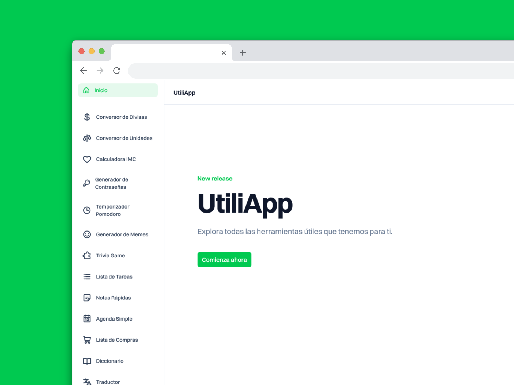
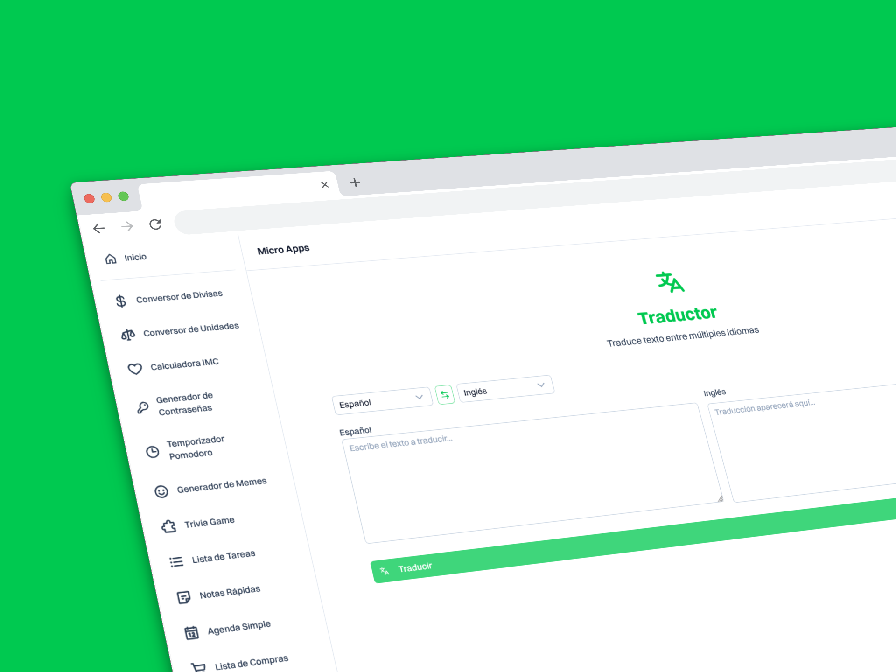

# UtiliApp 🛠️

**UtiliApp** es una aplicación de utilidades todo-en-uno que reúne en un solo lugar varias herramientas prácticas y rápidas para el día a día.  
Hecha con ❤️ para ser tu kit de productividad personal.

## 🚀 Funcionalidades actuales

- ⚖️ **Calculadora BMI (Índice de Masa Corporal)** – Calcula tu índice de masa corporal y conoce tu estado físico.
- 💱 **Convertidor de divisas** – Convierte entre diferentes monedas en tiempo real.
- ⏳ **Pomodoro Timer** – Técnica de productividad con ciclos de enfoque y descanso.
- 🖼️ **Generador de memes** – Sube una imagen, agrega texto y crea memes fácilmente.
- 📖 **Diccionario** – Busca definiciones rápidas de palabras.
- 🌐 **Traductor** – Traduce textos a varios idiomas.
- ... ¡y más utilidades en camino!

## 🏗️ Tecnologías usadas

- **Framework**: [Nuxt 3](https://nuxt.com/)
- **UI**: [NuxtUI](https://ui4.nuxt.com/)
- **Estado & fetching**: [Pinia](https://pinia.vuejs.org/) + [TanStack Vue Query](https://tanstack.com/query/latest/docs/vue/overview)
- **Backend/APIs**:
  - [ExchangeRate API](https://www.exchangerate-api.com/) _(para conversiones de divisas)_
  - [Dictionary API](https://freedictionaryapi.com/) _(para definiciones)_
  - [LibreTranslate](https://libretranslate.com/) _(para traducciones)_

**UtiliApp** es una aplicación de utilidades todo-en-uno que reúne en un solo lugar varias herramientas prácticas y rápidas para el día a día.
Hecha con ❤️ para ser tu kit de productividad personal.
